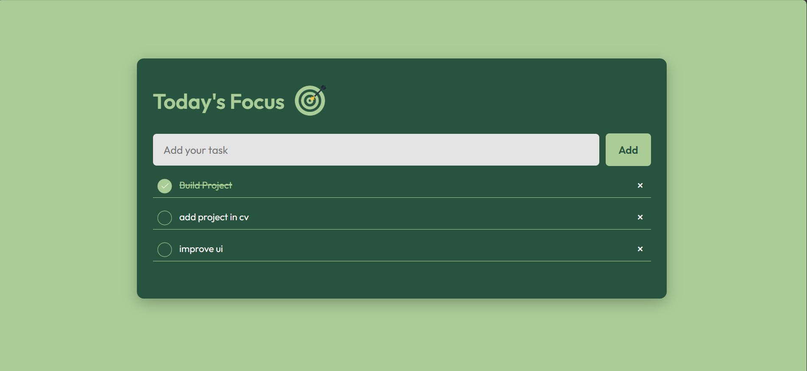

# 📝 To-Do List Web App

A simple, elegant, and interactive **To-Do List Application** built to help users manage daily tasks efficiently.  
This project demonstrates core front-end development concepts — including dynamic DOM manipulation, local storage integration, and responsive UI design.

---

## 🚀 Features

✅ **Add Tasks** – Instantly add new tasks with a single click.  
✅ **Mark as Complete** – Check off tasks when done; completed tasks appear with a strikethrough.  
✅ **Delete Tasks** – Remove tasks individually (optional enhancement).  
✅ **Persistent Storage** – Uses **localStorage** to save tasks so they remain even after refreshing the page.  
✅ **Clean UI/UX** – Minimal, modern interface designed for clarity and ease of use.  
✅ **Responsive Design** – Works seamlessly on desktop, tablet, and mobile devices.

---

## 🖥️ Preview

  
> A preview of the app interface featuring task management with a clean green-themed design.

---

## 🧩 Tech Stack

| Technology | Purpose |
|-------------|----------|
| **HTML5** | Page structure and semantic layout |
| **CSS3 / TailwindCSS** | Styling and responsive design |
| **JavaScript (ES6)** | Task logic, DOM manipulation, and storage handling

---

## ⚙️ How It Works

1. Enter a task in the input field.  
2. Click the **Add** button to add it to your task list.  
3. Click the circle/check icon or the task to mark a task as **completed**.  
4. (Optional) Click the delete icon to remove a task.  
5. All tasks are saved automatically in **localStorage**, so they persist after a page reload.

---

## 🪄 Future Enhancements

🔹 Add category filters (All / Active / Completed)  
🔹 Implement due dates and reminders  
🔹 Add drag-and-drop task reordering  
🔹 Introduce dark/light theme toggle  
🔹 Integrate with a backend (Node.js / Firebase) for cloud sync  

---
